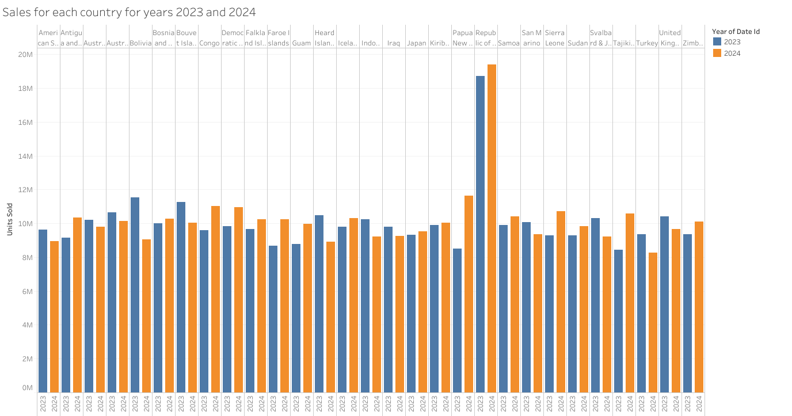

# Data Engineering Project - Funland Team

This repository contains the final team project of the North Coders Data Engineering Bootcamp, showcasing a full-stack ETL (Extract, Transform, Load) pipeline designed for real-world data engineering practice.

- Data ingestion from PostgreSQL into AWS S3 data lakes.

- Transformation into star-schema format using pandas and awswrangler.

- Deployment managed with Infrastructure-as-Code (Terraform).

- Automated testing and deployment with CI/CD pipelines via GitHub Actions and Makefile.

- Monitoring, logging, and alerts integrated via AWS CloudWatch and SNS.

- Business dashboards and insights delivered through Tableau.


## Tech Stack

**Python:**\
awswrangler 3.12.0 \
boto3 1.38.24 \
pandas 2.3.0 \
pg8000 1.31.2 \
pytest 8.3.5 \
urllib3 2.4.0

**Terraform**\
**Git**


## Installation 

To install this project, run:

```bash
git clone https://github.com/sapkotahari/de-project-funland
cd de-project-funland
```

Create a virtual environment 

```python 
python -m venv venv 
```
Activate your venv

```python 
source venv/bin/activate
```
**Install packages** <br><br>
Required packages are listed in our requirements.txt and can be installed using our makefile. 

```bash
make requirements
``` 
## Usage/Examples
Firstly, activate your virtual environment

```bash
source venv/bin/activate
```

To use AWS services and infrastructure, sign up to a AWS account and create a IAM user. Once this is done, extract your AWS_ACCESS_KEY_ID and AWS_SECRET_ACCESS_KEY.

```bash
export AWS_ACCESS_KEY_ID=<your key id>
export AWS_SECRET_ACCESS_KEY=<your secret access key>
export AWS_DEFAULT_REGION=<your default region>
```

An AWS parameter needs to be put into parameter store with a parameter name of "last_checked". This parameter is a date in the format "YYYY-MM-DD HH:MM:SS:ffffff". This date should be some date before 2019, to ensure that all the data gets extracted from the database initially.\ 

In AWS secret manager, your should set up a secret with the name "db_creds" with 4 key value pairs e.g.:

```console
{
"DB_USER":<your database username>,
"DB_PASSWORD":<your database password>,
"DB_HOST":<your database host>,
"DB_NAME":<your database name>,
"DB_PORT":<your database port>
}
```


Now your aws account is linked to your local terminal and you are ready to navigate to the terraform directory

```bash
cd terraform
```

In this directory, an initialisation is needed to download the required hashicorp version and to setup the location of the terraform state file remotely. To accomplish this, we run:

```bash
terraform init
```

Once this finished, we are ready to see a plan of the infrastructure and its availability:

```bash
terraform plan
```

Be sure that all the information looks correct, and we are ready to deploy!! Run:

```bash
terraform apply
```

All the infrastructure should be created (ingestion and processed buckets, ETL lambdas and a step function to facilitate them, alongside the necessary roles and cloudwatch logs and notification systems):

```console

Apply complete! Resources: 1 added, 0 changed, 1 destroyed.

Outputs:

notification_email = "<email to receive error notifications>"

```


To see the infrastructure, we can use AWS CLI to view our buckets:

```bash
aws s3 ls
```


example output:

```console
2025-05-28 10:24:59 <ingestion-bucket-name>
2025-05-28 10:24:59 <processed-bucket-name>
```

And checking the AWS console for our state machine we can see:


## Running Tests

Setup an .env file with the following values:

```console
totesys_user=<your database username >
totesys_password=<your database password>
totesys_database=<your database database>
totesys_host=<your database host>
totesys_port=<your database port>
```

Add the given PYTHONPATH to your environment variables:

```bash
export PYTHONPATH=$(pwd)
```


To run tests, run the following command:

```bash
   make unit-test
```
To run all checks (tests, linting, security and coverage), run the following command:

```bash
   make run-checks
```


## Visuals


A graphic representation showing the countries where the products are sold. The size of the dot corresponds to sales in the corresponding country.



A graph showing sales for each country for the years 2023 and 2024.


A graph showing sales for each city for the years 2023 and 2024.


A graph showing total sales by month.


## Acknowledgements

We would like to acknowledge **[Northcoders](https://www.northcoders.com/)** for providing the **Data Engineering Bootcamp**, which was instrumental in building the foundations for this project.  


We also used the following resources and tools throughout the project:
- [Pandas](https://pandas.pydata.org/docs/index.html) - For data sanitising.
- [Boto3](https://boto3.amazonaws.com/v1/documentation/api/latest/index.html) - The Amazon Web Services (AWS) SDK for Python, used extensively for interacting with AWS services.
- [Terraform Official Documentation](https://developer.hashicorp.com/terraform/docs) - Comprehensive and clear documentation that helped in managing infrastructure as code.
- [AWS Wrangler](https://aws-data-wrangler.readthedocs.io/en/stable/) - A Python library that made working with AWS data services much easier.


## Authors

- [@Leda909](https://github.com/Leda909)
- [@lisa624](https://github.com/lisa624)
- [@sapkotahari](https://github.com/sapkotahari)
- [@sarah-larkin](https://github.com/sarah-larkin)
- [@shayanshater](https://github.com/shayanshater)


