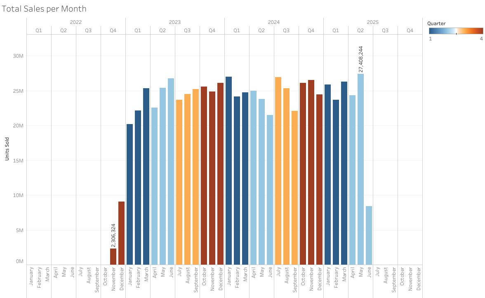

# Data Engineering Funland Team Project

## Overview

This repository contains the implementation of a data engineering pipeline designed to simulate an end-to-end ETL (Extract, Transform, Load) solution. The system ingests data from an operational database, sanitize and transforms the data into a star-schema data warehouse, and provides visualizations for business intelligence purposes.

The project is built on AWS cloud services, leverages infrastructure-as-code, incorporates best practices in cloud monitoring, error logging, security, and aims to demonstrate a production-like, resilient data platform.

## Objectives

    *   Follow clean code principles: structured repository layout, consistent file naming conventions, modular design, and PEP8-compliant codebase.
    *   Apply Agile development methodology, use project management tools such as Trello and Slack.
    *   Implement Continuous Integration / Continuous Deployment (CI/CD) pipelines using GitHub Actions and Makefiles to automate testing, security and deployment processes.
    *   Apply Test-Driven Development (TDD) approach to ensure reliable and maintainable code with test coverage.
    *   Provision infrastructure using Infrastructure-as-Code (IaC) with Terraform to enable repeatable, version-controlled cloud resource deployment.
    *   Develop data pipelines to extract data from a PostgreSQL relational database and ingest it into AWS S3-based data lakes.
    *   Sanitize, transform, and remodel ingested data into a star-schema data warehouse model using pandas and awswrangler.
    *   Load transformed data into an AWS-hosted data warehouse (e.g. Redshift or PostgreSQL warehouse).
    *   Implement robust monitoring, alerting, and centralized logging via AWS CloudWatch and SNS to ensure pipeline observability.
    *   Build visualizations and business intelligence dashboards using Tableau for business reporting and insights.


## Project Title - Adel

A brief description of what this project does and who it's for


## Tech Stack - Hari

**Python:**
awswrangler 3.12.0
boto3 1.38.24
pandas 2.3.0
pg8000 1.31.2
pytest 8.3.
urllib3 2.4.0

**Terraform**
**Git**


## Installation 

Create a virtual environment 

```python 
python -m venv venv 
```
Activate your venv

```python 
source venv/bin/activate
```
**Install packages** <br><br>
Required packages are listed in our requirements.txt and can be installed using our makefile. 

```bash
make -f makefile
``` 

**Terraform** 

Initialise Terraform 

```bash
cd terraform
terraform init 
```
Backend has been set up to store the statefile separately. This can be reviewed in terraform/main.tf

Terraform can be run using the following commands: 
```bash 
terraform plan 
terraform apply
```

    
## Usage/Examples  - Shayan

```javascript
import Component from 'my-project'

function App() {
  return <Component />
}
```


## Running Tests - Elisa

To run tests, run the following command

```bash
  npm run test
```


## Visuals - Hari





## Acknowledgements - Adel

 - [Awesome Readme Templates](https://awesomeopensource.com/project/elangosundar/awesome-README-templates)
 - [Awesome README](https://github.com/matiassingers/awesome-readme)
 - [How to write a Good readme](https://bulldogjob.com/news/449-how-to-write-a-good-readme-for-your-github-project)


## Authors

- [@Leda909](https://github.com/Leda909)
- [@lisa624](https://github.com/lisa624)
- [@sapkotahari](https://github.com/sapkotahari)
- [@sarah-larkin] (https://github.com/sarah-larkin)
- [@shayanshater](https://github.com/shayanshater)


